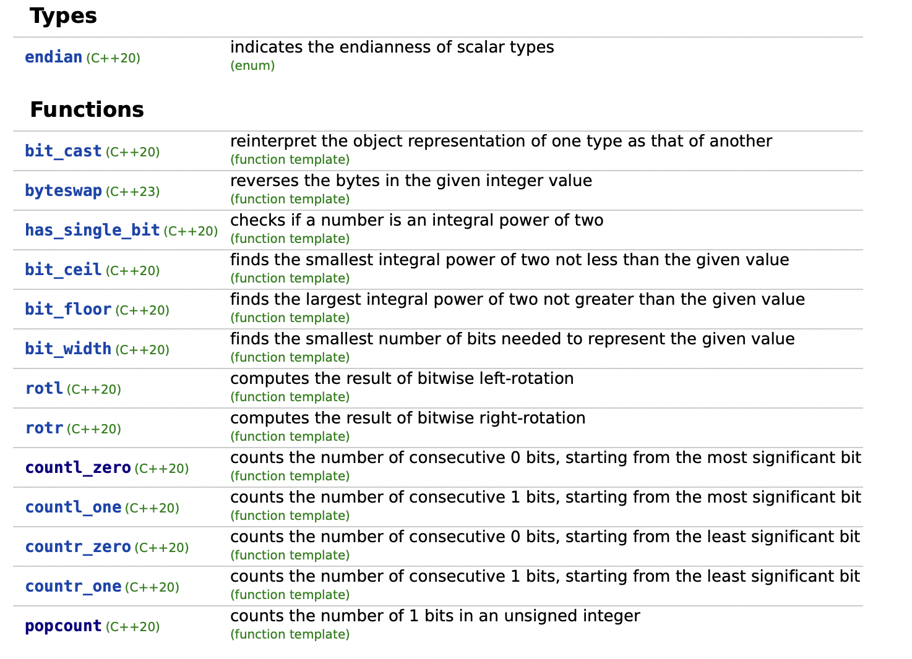

# Table of Contents
1. Linked Lists:
    1. [Linked List Cycle](#linked_list_cycle)
2. Dynamic Programming
    1. [Dynamic Programming - Knapsack](#knapsack)
3. Sorting
    1. [Custom Sorting](#custom_sort)
    2. [Bucket Sort](#bucket_sort)
4. Bit Manipulation
    1. [All possible subsets](#all_possible_subsets)
    2. [Bit Set and Builtin Popcount](#bit_set)
    3. [Bit library C++](#bit)
    4. [Builtin Functions GCC Compiler](#gcc_builtin_functions)
    5. [Mod vs Bitwise operators](#mod_vs_bitwise_operators)
    6. [Bit Tricks](#bit_tricks)
5. Heap/Priority Queues
    1. [HeapSort](#heapsort)
    2. [Custom Priority Queue](#custom_priority_queue)
6. Graphs
    1. BFS/DFS
        1. [DFS using stack(iterative dfs)](#iterative_dfs)
    2. Shortest Path
        1. [Bellman Ford](#bellman_ford)
        2. [Dijsktra's Algorithm](#dijkstra)

# Linked List Cycle<a name="linked_list_cycle"></a>
1. Given a linked list, tell where does the cycle begin, *if there is any*.

## Solution
1. Check cycle by the slow-fast pointer method.
    1. If fast becomes `NULL` - no cycle.
    2. If `slow == fast` - cycle located.
2. Measure the length of cycle, i.e. the number of nodes in the cycle = `l`.
3. Now, initialize `slow` at `head`, travel `l` nodes forward.
4. Now initialize `fast` at head, and iterate till `slow == fast`.
5. The following diagram explains why this works: 


# Dynamic Programming - Knapsack<a name="knapsack"></a>
1. Its not always necessary to think about building up on the array.
    1. for eg. dp[i] = will depend on arr[0...i]
    2. you could rather think about this target variable, and start building up on either target=0 or target=target.
2. Similar problem - [Combination Sum IV](https://leetcode.com/problems/combination-sum-iv/)

# HeapSort<a name="heapsort"></a>
1. 0th index = top element of heap.
2. for ith index: children = `2*i+1,2*i+2`
    1. 
    ```cpp
    /* 
    sample vec: [[1,3],[2,5],[3,7],[4,9],[4,11]]
    initial heap-structure:
           1,3(0)
      2,5(1)    3,7(2)
    4,9(3) 4,1(4)
    */
    ```
3. Heapify:
    1. For the given node `parent`, convert the heap-subtree below this `parent` node such that it obeys the heap's ordering constraints.
    2. For instance: 
        1. <u>Ordering Constraints:</u> a parent node should be `<=` both its child nodes, if a **heap is a min-heap**.
    3. Sample code:
    ```cpp
    bool comparator(vector<int> v1, vector<int> v2){
        // return true if v1 should be placed before v2 in ordering
        double a1 = v1[0], b1 = v1[1], a2 = v2[0], b2 = v2[1];
        return (a1/b1 < a2/b2);
    }
    void heapify(vector<vector<int>> &vec, bool (*comparator)(vector<int>, vector<int>), int parent, int heap_size){
        // start ordering children nodes w.r.t. their parents, from the node `parent`
        int left = parent*2+1, right = parent*2+2;
        int smallest = parent;
        if(left < heap_size && !comparator(vec[parent], vec[left])){
            // parent should come after left in the ordering
            smallest = left;
        }
        if(right < heap_size && !comparator(vec[smallest], vec[right])) smallest = right;
        if(smallest != parent){
            // swap parent with the smallest
            // here smallest means that vec[smallest][0]/vec[smallest][1] is the smallest of (parent,left,right)
            int c = vec[smallest][0];
            vec[smallest][0]; = vec[parent][0];
            vec[parent][0] = c;

            c = vec[smallest][1];
            vec[smallest][1]; = vec[parent][1];
            vec[parent][1] = c;

            heapify(vec, comparator, smallest, heap_size);
        }
    }
    /*
    Heap Constraints:
    each parent node will have the a/b ratio less than either of its children
    */
    ```
    4. To construct the heap, we need to call this function only once, at the root node(`parent=0`).
4. HeapSort Main algorithm:
    1. Initialize `heap_size=n`
    2. For all parent nodes, starting from the last parent = `(n/2)` till `0`:
        1. Run heapify from the last parent node, i.e. the `(n/2)'th` node.
        2. Swap the root with the valid last element[`(heap_size-1)'th`] element. 
        3. Decrease the size by 1, i.e. `heap_size--`.


# Bucket Sort<a name="bucket_sort"></>
1. [bucketsort.cpp](./bucketsort.cpp)
2. For floating points with no integral part(i.e. in between 0 and 1), the `bucketing function` would be `10*arr[i]`.

# Custom Sorting<a name="custom_sort"></a>

1. The value returned indicates whether the element passed as first argument is considered to go before the second in the specific strict weak ordering it defines. [Doc link](https://cplusplus.com/reference/algorithm/sort/)
2. In other words, `comp(x,y)` should return true if `x `is supposed to be placed before `y` in the resulting vector.
3. Furthermore from the documentation: *This can either be a function pointer or a function object.*
    1. Usually for comparator, we should pass the class that encompasses the `operator()` member function -> **Function object method**.
        ```cpp
        class cmp{
            public:
            bool operator() (int a, int b){return a < b;}
        };
        ...
        vector<int> vec;
        ...
        sort(vec.begin(), vec.end(), cmp());
        ```
    2. The **function pointer** method involves passing the comparator functions's pointer:
        ```cpp
        bool cmp (int a, int b){return a < b;}
        ...
        vector<int> vec;
        ...
        sort(vec.begin(), vec.end(), cmp);
        ```
        1. This by itself works if cmp is not a member function of some class.
            ```cpp
            bool cmp (int a, int b){return a < b;}
            ...
            int main(){
                vector<int> vec;
                ...
                sort(vec.begin(), vec.end(), cmp);
                ...
                return 0;
            }
            ```
        2. But if the `cmp` has to be included as a member function of the *`Solution`* class, then it cannot be non-static.
        3. This could be avoided if the `cmp` function is written outside the body of `class Solution`.
        4. Another alternative: use the **`lambda format`**: `sort(vec.begin(), vec.end(), [](int a, int b) -> bool {return a < b; });`
4. 


# All possible subsets<a name="all_possible_subsets"></a>
```cpp
int len = 1 << numsSize; // the number of subsets is 2 ^ |S|
for(int i = 0; i < len; i++){ //iterate over every subset
    int subtotal = 0;
    for(int j = 0; j < numsSize; j++){ //iterate over every nums element
        if((1 << j) & i){ //check if nums element is in subset
            // enter code here
        }
    }
}
```

# Bit Set and Builtin Popcount<a name="bit_set"></a>
**`#include<bitset>`**
1. Bit set : Stores the M-bit representation of a given number.(`bitset<32> varname(a)`, if a = 7, `varname = 00000000000000000000000000000111`, 32 bits since 32 was given)
    1. `varname.count()` returns 3 --> `count()` returns the number of set bits.
    2. fetching count without declaring a variable: `bitset<32>(a).count()`
    3. `cout` is supported: `cout << varname;` = `00000000000000000000000000000111`
    4. this M number can **easily exceed 64**, it can be something like 365.
2. space taken is less than bool[n] and vector bs[n], `n` must be known at compile time(or declare `bitset<32>`).
3. Bitset stores the same information in compressed manner the operation on bitset are faster than that of array and vector.
4. `bs[3]` shows bit at index `3` of bitset bs just like a simple array(index `3` means the **`4th bit`** and not the `index` in the array sense).
5. We can construct a bitset using integer number as well as binary string: `bitset<8>string("11100")` = `00011100`
6. [Documentation](https://en.cppreference.com/w/cpp/utility/bitset) page shows the operators supported by this class.

# Bit library C++<a name="bit"></a>
1. [`#include<bit>`](https://en.cppreference.com/w/cpp/header/bit)
2. refer to the functions: 


# Builtin Functions GCC Compiler<a name="gcc_builtin_functions"></a>
**Note:** For all of the functions listed below, no need to import anything.
1. `__builtin__popcount(a)` returns the number of set bits in a, a: unsigned (short, int, char, long).
    1. for `unsigned long long` or `long long`, use `__builtin_popcountll(a)`.
2. `__builtin_parity(x)` - returns true(1) if odd number of set bits(odd parity) else 0. use `__builtin_parityl(x)` and `__builtin_parityll(x)`  for `long` and `long long` datatypes.
3. `__builtin_clz(x)` - returns count of leading number of 0's in bit-representation. use `__builtin_clzl(x)` and `__builtin_clzll(x)`  for `long` and `long long` datatypes.
4. `__builtin_ctz(x)` - returns count of trailing number of 0's in bit-representation. use `__builtin_ctzl(x)` and `__builtin_ctzll(x)`  for `long` and `long long` datatypes.

# Mod vs Bitwise operators<a name="mod_vs_bitwise_operators"></a>
1. `n << 1` better than `2*n`
2. `n & 1` better than `n%2`

# Bit Tricks<a name="bit_tricks"></a>
1. rightmost set bit of a number: `n & ~(n-1)`.
    1. rightmost set bit means that there are only 0's after it in the bit representation of n.
    2. hence `n = ----1000...`, for n-1 that 1 will be carried over to previous positions, thus making these trailing zeros to ones. \
    `n-1 = ----0111...(all 1's)`, now complementing `n-1` will make that carried-over bit set, and the trailing ones(which were trailing zeros initially, to `0's`)
    3. now obviously `n & n-1` will give a number whose ONLY set bit is the rightmost set bit of n.
2. Int to Hex and Hex to Int
    1. ```cpp
       int x=942; stringstream ss;ss << hex << x; 
       string res = ss.str();
       cout << "0x" << res << endl; // prints 0x3ae
       ```
    2. ```cpp
       string s="0x3ae"; stringstream ss;ss << std::hex << s; 
       int x; ss >> x;
       cout << x << endl; // print 942
       ```
    3. Hex is an I/O manipulator(`#include<iostream>`) that takes reference to an I/O stream as parameter and returns reference to the stream(`#include <sstream>`) after manipulation.
3. COUNT DISTINCT ALPHABETS FROM LEFT AND RIGHT:
    1. **Required condition: either all are lowercase or all are uppercase.**
    2. 'a' - bit 0, 'b' - bit 1.... 'z' - bit 26
    3. ```cpp
        int l = 0;
        int n = s.length();vector<int> left(n, 0), right(n, 0);
        for(int i=0;i<n;i++){l |= (1 << (s[i]-'a')); left[i] = __builtin_popcount(l);}
        for(int i=n-1;i>=0;i--){r |= (1 << (s[i]-'a')); right[i] = __builtin_popcount(r);}
        ```
4. Gray Code
    1. Cyclic permutation where `arr[i]` and `arr[i+1]` have only one bit different, and `arr[0]` and `arr[(1<<n)-1]` have only one bit different.
    2. ```cpp
        vector<int>temp(1<<n),ans(1<<n);
        int ind=0;
        for(int i=0;i<(1<<n);i++){
            temp[i]=i^(i>>1);
            if(temp[i]==start){
                ind=i;
            }
        }
        for(int i=0;i<(1<<n);i++){
            ans[i]=temp[ind++%(1<<n)];
           
        }
       ```
    3. **Why this works?**
        1. lets take a number of the form a.b.c , where a,b,c, all are bits.
        2. Case-1: c=0, then current index = a.b.0 , next index = a.b.1, current number = a.b.0 ^ 0.a.b = a.a^b.`b` , next number = a.b.1 ^ 0.a.b = a.a^b.b^1 = a.a^b.`~b` . Hence we have the last bit changed.
        3. Case-2: c=1,b=0,a=1(atleast one bit after msb is unset), current index = 1.0.1, current number = 1.0.1 ^ 0.1.0 = 1.`1`.1 , next index = 1.1.0, next number = 1.1.0 ^ 0.1.1 = 1.`0`.1. Hence the middle bit, i.e. *the first 0 from right*, is changed.
        4. Case-3: a=1,b=1,c=1(*all bits are set*), current index = `0`.1.1.1, **current number = 1.1.1 ^ 0.1.1 = `0`.1.0.0** , next index = 1.0.0.0, **next number = 1.0.0.0 ^ 0.1.0.0 = `1`.1.0.0**. Hence again, *the first 0 from right*, is changed.
        5. Possible reason for the above observation: if 1 is added, the first zero from right is the position where *carrying over* stops, and it itself flips to 1.
            - bits further left of this bit remain unaffected(hence shift xoring doesn't affect positions on the left of this 0 bit).
            - the bit xored with 0 is itself, whereas the bit xored with 1 is the complementary.
            - hence, when the next index is xored, the result at this position will be the complementary of the bit at this position obtained from xoring the previous index.
            a.b.c.0.1.1-->a.b^a.c^b.`0^c`.1.0 , a.b.c.1.0.0 --> a.b^a.c^b.`1^c`.0^1.0^0
            - we right shift instead of left shift, because left shift will produce another different bit, at the new MSB position(`0`.1.b.c.0.1.1 ----> `1`.b.c.0.1.1.1).
            - right shifting causes the previous-index's MSB to become 0, hence now xoring would give back the original MSB value(`1`.a.b.c.... ---> `0`.1.a.b.c....., XOR = `1`.~a.a^b.b^c.....).
            
5. Bit length of iterator(i: 1...n)
    1. Whenever going from 2^n-1 to 2^n , the length increases.
    2. staying in between 2^(n-2)...2^n-1 , the length remains the same.
    3. ```cpp
        int len = 0;
        for(int i=1;i<=10;i++){
            if(i & (i-1) == 0){
                // this captures the 2^n-1 ---> 2^n change
                len++;
            }
            cout << "Bit length for " << i << " is " << len;
        }
       ```

# Custom Priority Queue<a name="custom_priority_queue"></a>

## Constructor

## Operator Function
1. [From documentation:](https://cplusplus.com/reference/queue/priority_queue/) The expression `comp(a,b)`, where `comp` is an object of this type and `a` and `b` are elements in the container, shall return true if `a` is considered to go before `b` in the strict weak ordering the function defines.
    1. **Note:** Priority queues are a type of container adaptors, specifically designed such that its *first element is always the greatest of the elements* it contains, according to some strict weak ordering criterion.
    2. Lambda Function as comparator:
        ```cpp
        auto comp = [](int a, int b){return a > b;};
        priority_queue<int,vector<int>,decltype(comp)> pq(comp);
        ```
    3. if `a > b` then `a` will be placed before, hence the greatest(top) element of the heap will be the one placed last, i.e. the smallest one. Hence this is a min-heap.
    **Note:** The same lambda function for `sort` would return the array sorted in non-increasing order.

## Less Than override

## Greater than override

# DFS using stack(iterative DFS)<a name="iterative_dfs"></a>

# Bellman Ford Algorithm<a name="bellman_ford"></a>
1. Single Source Shortest path to all nodes.
2. Initialize Adjacency list: (node,edgeWeight)
3. Initialize dist array with all values as INT_MAX
4. Check if negative edge cycle exists:
    1. dist[start] = 0
    2. For `|V|-1` times, iterate through all edges `E` of the graph, updating `dist[v]` to `dist[u]+edgeLen` for each edge if `dist[v]` was larger. \
       For each edge, this operation is known as *relaxing an edge*.
    3. Again relax all edges once to see if any `dist[u]` gets updated, if yes, then there is a negative edge cycle.
5. If not:
    1. `dist` contains the shortest distance for each node from starting node.
6. Hence, **for Bellman Ford** , we require an **edge-representation of a graph**.

# Dijsktra's Algorithm<a name="dijkstra"></a>
1. Single Source Shortest path to all nodes.
2. Initialize Adjacency list: (node,edgeWeight)
3. Initialize dist array with all values as INT_MAX
4. Initialize a priority queue(as a min heap), push (0, start) because distance of start from start is 0.
5. Iterate while the priority queue is not empty:
    1. Pop the top = (distVal, node).
    2. `if dist[node] <= distVal`
        1. `dist[node] = distVal`
        2. Iterate through all nodes in the adjacency list of node, `adjNode`:
            1. If `dist[adjNode] > dist[node]+adjNodeEdgeVal`, make `dist[adjNode] = dist[node]+adjNodeEdgeVal` and
            2. push `(dist[adjNode], adjNode)` to the priority queue.
6. We can easily see that if we have a negative edge weight cycle, i.e. a cycle with the sum of all edge weights being negative, then we will always iterate through the nodes of this cycle, updating the `dist[]` to a smaller value , and hence the update will become an infinite loop.
7. Hence we first need to check/be sure that the input graph doesn't have a negative cycle.
8. Time Complexity = O((V+E)logV) , Memory: O(V+E)
