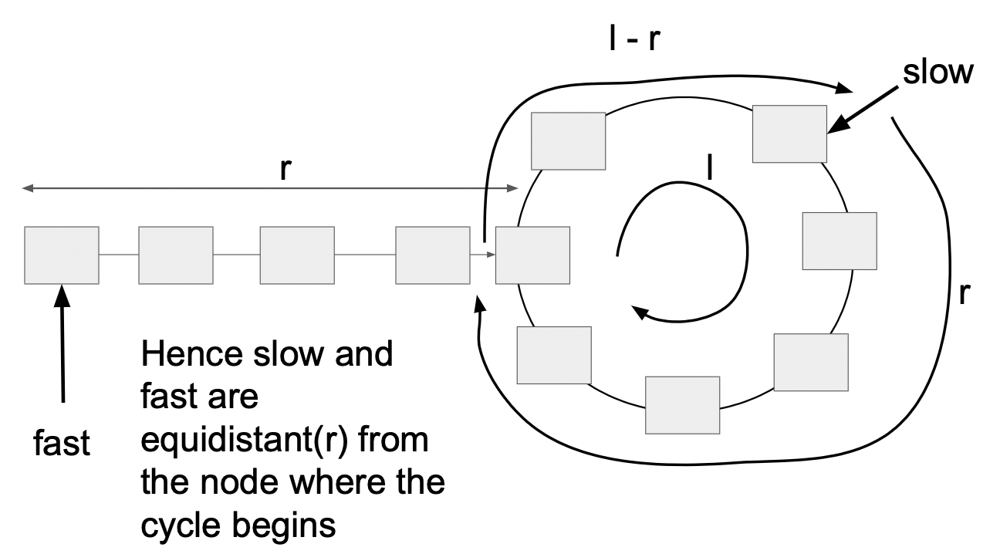

# Table of Contents
1. [Linked List Cycle](#linked_list_cycle)

# Linked List Cycle
1. Given a linked list, tell where does the cycle begin, *if there is any*.

## Solution
1. Check cycle by the slow-fast pointer method.
    1. If fast becomes `NULL` - no cycle.
    2. If `slow == fast` - cycle located.
2. Measure the length of cycle, i.e. the number of nodes in the cycle = `l`.
3. Now, initialize `slow` at `head`, travel `l` nodes forward.
4. Now initialize `fast` at head, and iterate till `slow == fast`.
5. The following diagram explains why this works: 
