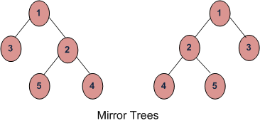

# Table Of Contents

1. [Mirror a Binary Tree](#mirror-tree)
   1. [solution](#sol1)
2. [Symmetric Tree](#symmetric-tree)

# Mirror a Binary Tree

1.  Mirror of a Binary Tree T is another Binary Tree M(T) with left and right children of all non-leaf nodes interchanged.
2. 

## Solution

1. [CODE](mirrorTree.cpp), [TEST](mirrorTreeTest.txt)
2. Call Mirror for left-subtree
3. Call Mirror for right-subtree
4. Swap left and right subtrees.
5. [geeksforgeeks practice](https://practice.geeksforgeeks.org/problems/mirror-tree/1)

# Symmetric Tree

1. basically check if a tree is a mirror image of itself.
2. check if roots are mirror images
   1. if roots are both NULL, or both have same value, move forward, if not return `false`.
3. return `isMirror(root1->left, root2->right) && isMirror(root1->right, root2->left)`, meaning that 
   1. left subtree of left tree and right subtree of right tree have to be mirror images
   2. right subtree of left tree and left subtree of right tree have to be mirror images
4. [CODE](isSymmetric.cpp)